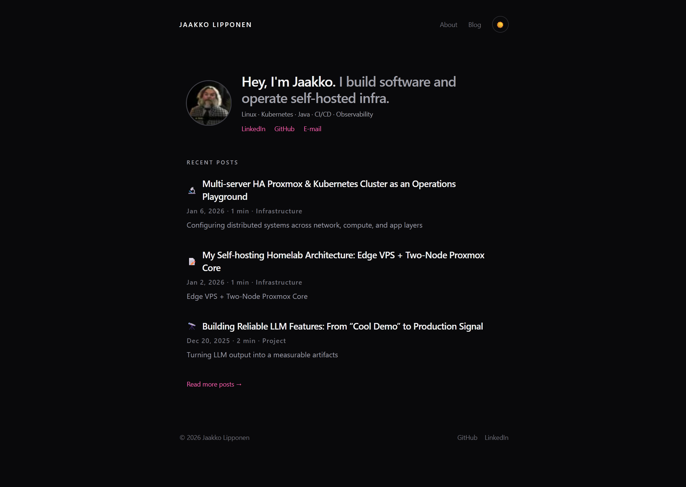

````md
# Portfolio (Astro + Tailwind v4 + Markdown Blog)

Developer portfolio + Markdown blog inspired by www.conordewey.com.  
Static-first Astro site, self-host friendly, with light/dark theme support and content collections for posts.



## Features

- Astro static site (fast, minimal JS)
- Tailwind CSS v4 (CSS-first config)
- Markdown blog via `src/content/posts/*`
- `/` landing page with recent posts
- `/blog` list page + `/blog/[slug]` post pages
- `/about` page
- Theme toggle (defaults to system; persists user choice)
- SVG social icons (inline via `?raw`), brand-color hover support
- Self-hostable output (`dist/`)

## Tech Stack

- Astro
- Tailwind CSS v4
- `@tailwindcss/typography` for blog typography
- Astro Content Collections

## Project Structure

```txt
src/
  components/
    HomeHero.astro
    SiteHeader.astro
    SiteFooter.astro
    ThemeToggle.astro
    PostListItem.astro
  content/
    posts/
      *.md
  layouts/
    BaseLayout.astro
  pages/
    index.astro
    about.astro
    blog/
      index.astro
      [slug].astro
  styles/
    global.css
  assets/
    avatar.jpg
    icons/
      *.svg
```
````

## Content: Writing Posts

Create a new Markdown file in:

`src/content/posts/my-post.md`

Frontmatter example:

```md
---
title: "My Post Title"
date: "2026-01-09"
tag: "DevOps"
icon: "📝"
excerpt: "Short summary shown on the landing page."
---

Post content here...
```

## Development

Install dependencies:

```bash
npm install
```

Run dev server:

```bash
npm run dev
```

Build:

```bash
npm run build
```

Preview build locally:

```bash
npm run preview
```

## Tailwind v4 Notes

This project uses Tailwind v4 CSS-first setup.

Typography plugin is enabled in `src/styles/global.css`:

```css
@import "tailwindcss";
@plugin "@tailwindcss/typography";
@config "../../tailwind.config.cjs";
```

## Theme (Dark/Light)

- Defaults to system preference (fallback: dark)
- User selection persists in `localStorage`
- Implementation toggles a `.light` class on `<html>` (dark is default)

If you change the theme model, update:

- `src/styles/global.css` (tokens + `.light` overrides)
- `src/components/ThemeToggle.astro` (toggle logic)
- `src/layouts/BaseLayout.astro` (early theme init script)

## Social Icons (SVG)

Place icons in:

`src/assets/icons/*.svg`

Requirements:

- Use `fill="currentColor"` / `stroke="currentColor"` so icons inherit link color
- Imported as raw strings and inlined with `set:html`

Example import:

```astro
import githubIcon from "../assets/icons/github.svg?raw";
```

## Deployment / Self-Hosting

This is a static site. Deploy the `dist/` folder behind any web server.

Example (Nginx):

- Build with `npm run build`
- Serve `dist/` as the web root
- Configure SPA-like routing is NOT needed (Astro generates real HTML routes)

## Credits / Inspiration

Design inspiration: www.conordewey.com
