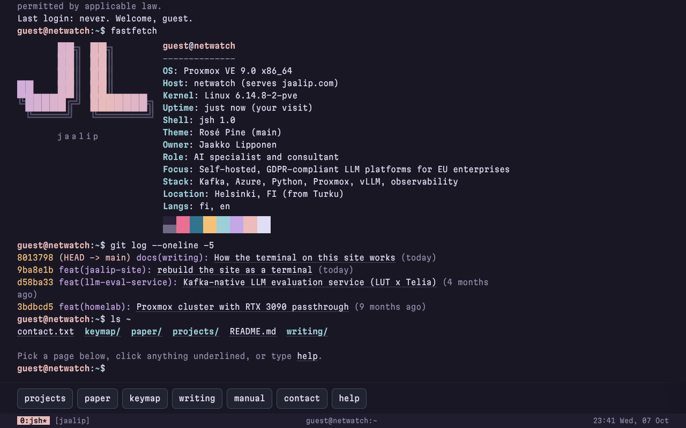

# jaalip.com

Personal site of Jaakko Lipponen. The homepage is a terminal: it boots like a Proxmox host, logs you in as `guest`, and runs a few commands for you. Every other page is plain HTML.



- Astro 7, static output. No server code.
- One vanilla JS island for the terminal. Other pages ship no JavaScript.
- Rosé Pine (main) palette, Martian Mono, self-hosted fonts.
- Site info in one config file. Projects and posts in Markdown.

## Run it

```bash
nvm use            # Node 24, from .nvmrc (22.12 or newer works)
npm install
npm run dev        # http://localhost:4321
npm run build      # static site in dist/
npm run check      # astro check + homepage size budget (run after build)
npm run preview    # serve dist/
```

## Update the site

| To change | Edit |
| --- | --- |
| Name, role, time zone, links, man page, fortunes | `src/site.config.ts` |
| The machine (host, OS, kernel, GPU) and the services in the boot log, `htop` and `docker ps` | `src/site.config.ts` |
| Pages (also the folders in `ls ~`, the terminal's menu) and their command aliases | `pages` in `src/site.config.ts` |
| A simple page's text (paper, keymap) | `src/content/pages/<id>.md` |
| Projects | `src/content/projects/<id>.md` |
| Posts | `src/content/writing/<id>.md` |
| Colors | `src/styles/tokens.css` |
| Easter eggs | `src/scripts/terminal/eggs.js` |

### Add a simple page

Add `{ id, path, title, blurb }` to `pages` in `src/site.config.ts`, then create `src/content/pages/<id>.md`. The page gets a route, a folder in `ls ~` and a command with its name. The build fails with a clear message if the Markdown file is missing.

### Add a project

Create `src/content/projects/<id>.md`. The file name becomes the URL (`/projects/<id>`) and the program name in the terminal (`~/projects/<id>`).

```md
---
title: Homelab
summary: One line, shown in lists, in the terminal and in git log.
date: 2026-01-02        # optional. Dated entries show up in git log.
status: active          # optional: active, done, planned, paused
context: Personal infrastructure
stack: [Proxmox, vLLM]
links:
  - label: Source
    url: https://github.com/you/repo
---

The full write-up in Markdown.
```

Then try `homelab`, `homelab --help` and `ls -l ~/projects` in the terminal.

### Add a post

Create `src/content/writing/<id>.md` with `title`, `description` and `date`. Set `draft: true` to keep it out of production builds.

## Deploy

Pushing to `main` runs `.github/workflows/deploy.yml`: build, check, upload `dist/` to the VPS as a new release, switch to it, then fetch `https://jaalip.com/version.txt` to prove the new release is live. You can also run it by hand from the Actions tab.

It needs these repository secrets: `VPS_HOST`, `VPS_PORT`, `VPS_USER`, `VPS_SSH_KEY`, `VPS_KNOWN_HOSTS`.

Pull requests run `.github/workflows/ci.yml` (build and checks only).

See `docs/deploy.md` for the secrets and rollback.

## Project docs

| Path | Purpose |
| --- | --- |
| `CLAUDE.md` | Project rules that Claude Code loads in every session |
| `.claude/skills/rebuild/` | The `/rebuild` interview, plan and build workflow |
| `docs/design-defaults.md` | Every design default in plain text |
| `docs/decisions/` | Dated decision records |
| `docs/reference/jaalip-tty.html` | The original prototype the terminal was ported from |
| `docs/deploy.md` | Deploy pipeline, secrets and rollback |
| `docs/fonts.md` | How the fonts are built |
